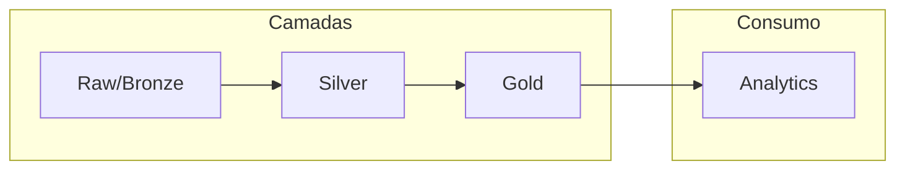

# SBD2 - Crime Data Pipeline

## 🎯 Visão Geral

Bem-vindo à documentação do projeto **SBD2 - Crime Data Pipeline**, desenvolvido para a disciplina de Sistemas de Banco de Dados 2 da Universidade de Brasília (UnB).

Este projeto implementa uma **infraestrutura completa de Data Engineering** para análise de dados de crimes em Los Angeles, utilizando as melhores práticas de engenharia de dados.

## 📊 Dataset

**Crime Data from 2020 to Present** - Dados de crimes reportados na cidade de Los Angeles, EUA.

- **Volume**: ~1 milhão+ de registros
- **Período**: 2020 - Presente
- **Fonte**: Los Angeles Open Data Portal

## 🏗️ Arquitetura

O projeto segue a arquitetura **Medallion** (Bronze → Silver → Gold):



## 🛠️ Componentes

| Componente | Tecnologia | Descrição |
|------------|------------|-----------|
| Processamento | Apache Spark | Processamento distribuído |
| Banco de Dados | PostgreSQL | Armazenamento estruturado |
| Containerização | Docker | Ambiente isolado e reproduzível |
| Notebooks | Jupyter | Pipelines ETL e análise exploratória |

## 🚀 Quick Start

```bash
# Clone o repositório
git clone https://github.com/dcasseb/SBD2.git
cd SBD2

# Inicie os serviços
make init

# Acesse os serviços
# Spark:   http://localhost:8081
# Jupyter: http://localhost:8888
```

## 📚 Navegação

- **[Arquitetura](overview/arquitetura.md)** - Detalhes da arquitetura do sistema
- **[Tecnologias](overview/tecnologias.md)** - Stack tecnológico utilizado
- **[Como Subir](overview/como-subir.md)** - Instruções de instalação
- **[Pipelines](overview/pipelines.md)** - Descrição dos pipelines ETL
- **[Modelagem](modeling/mer-der.md)** - Modelo de dados

## 👥 Equipe

Desenvolvido para a disciplina SBD2 - Sistemas de Banco de Dados 2 - UnB
