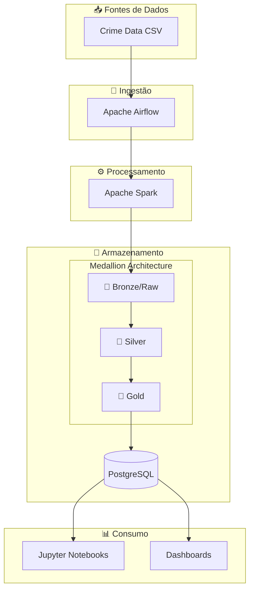

# Arquitetura do Sistema

## 🏗️ Visão Geral

O projeto implementa uma arquitetura de **Data Lake** moderna, seguindo o padrão **Medallion Architecture** (Bronze → Silver → Gold), amplamente utilizado em projetos de Data Engineering.

## 📊 Diagrama de Arquitetura



## 🎨 Camadas do Data Lake

### 🥉 Bronze (Raw)
- **Descrição**: Dados brutos, exatamente como recebidos da fonte
- **Formato**: CSV original
- **Transformações**: Nenhuma
- **Uso**: Preservação do dado original para auditoria

### 🥈 Silver
- **Descrição**: Dados limpos, validados e enriquecidos
- **Formato**: Parquet particionado
- **Transformações**:
    - Limpeza de valores nulos
    - Conversão de tipos
    - Validação de coordenadas
    - Criação de features temporais
- **Uso**: Análises exploratórias

### 🥇 Gold
- **Descrição**: Dados modelados dimensionalmente (Star Schema)
- **Formato**: Parquet + PostgreSQL
- **Transformações**:
    - Modelo dimensional
    - Agregações pré-calculadas
    - Métricas de negócio
- **Uso**: Dashboards e relatórios

## 🔌 Componentes

### Apache Airflow
- **Papel**: Orquestração de pipelines
- **DAGs**:
    - `crime_data_pipeline` - Pipeline principal
    - `bronze_to_silver` - ETL Bronze → Silver
    - `silver_to_gold` - ETL Silver → Gold
    - `crime_analysis` - Geração de análises

### Apache Spark
- **Papel**: Processamento distribuído
- **Jobs**:
    - Limpeza de dados
    - Feature engineering
    - Agregações

### PostgreSQL
- **Papel**: Armazenamento estruturado
- **Schemas**:
    - `silver` - Dados limpos
    - `gold` - Data Mart dimensional

### Docker
- **Papel**: Containerização
- **Serviços**:
    - `postgres`
    - `airflow-webserver`
    - `airflow-scheduler`
    - `spark-master`
    - `spark-worker`
    - `jupyter`

## 📁 Estrutura de Diretórios

```
SBD2/
├── airflow/
│   ├── dags/           # DAGs do Airflow
│   └── logs/           # Logs de execução
├── data_layer/
│   ├── raw/            # Camada Bronze
│   ├── silver/         # Camada Silver
│   └── gold/           # Camada Gold
├── docs/               # Documentação MkDocs
├── postgres/           # Configurações PostgreSQL
├── spark_config/       # Configurações Spark
├── transformer/        # Jobs ETL (notebooks)
├── docker-compose.yml  # Orquestração de containers
└── Makefile            # Comandos de automação
```
