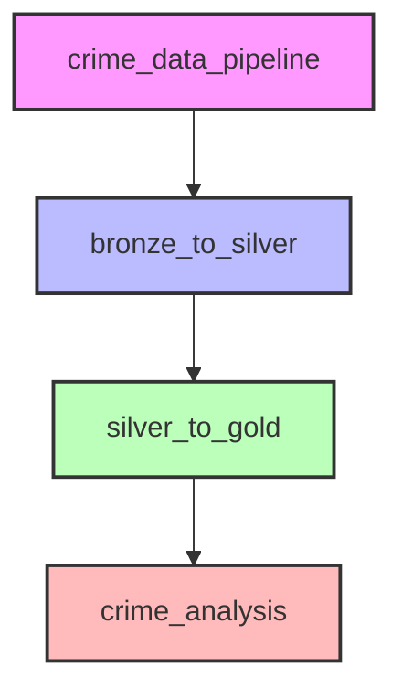
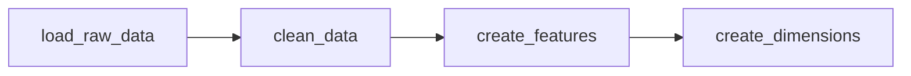
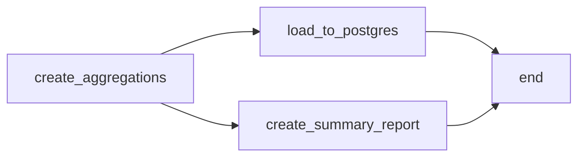
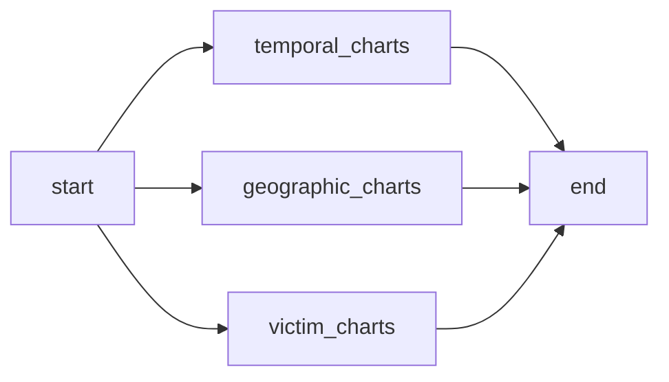

# Pipelines ETL

## 🔄 Visão Geral

O projeto possui 4 DAGs (Directed Acyclic Graphs) no Apache Airflow:



## 📋 Descrição das DAGs

### 1. crime_data_pipeline (Principal)

**Frequência**: Semanal (`@weekly`)

DAG orquestradora que dispara as demais DAGs em sequência.

```python
start >> bronze_to_silver >> silver_to_gold >> crime_analysis >> end
```

### 2. bronze_to_silver

**Frequência**: Sob demanda

Transforma dados brutos para a camada Silver.



#### Tasks:

| Task | Descrição |
|------|-----------|
| `load_raw_data` | Carrega CSV bruto |
| `clean_data` | Limpa valores nulos e inválidos |
| `create_features` | Cria features derivadas |
| `create_dimensions` | Gera tabelas de dimensão |

### 3. silver_to_gold

**Frequência**: Sob demanda

Transforma dados Silver para Data Mart (Gold).



#### Tasks:

| Task | Descrição |
|------|-----------|
| `create_aggregations` | Cria tabelas agregadas |
| `load_to_postgres` | Carrega dimensões no PostgreSQL |
| `create_summary_report` | Gera relatório JSON |

### 4. crime_analysis

**Frequência**: Sob demanda

Gera visualizações e análises.



#### Tasks:

| Task | Descrição |
|------|-----------|
| `generate_temporal_charts` | Gráficos temporais |
| `generate_geographic_charts` | Gráficos geográficos |
| `generate_victim_charts` | Gráficos de perfil de vítimas |

## 🔧 Configurações

### Variáveis de Ambiente

| Variável | Descrição | Padrão |
|----------|-----------|--------|
| `POSTGRES_HOST` | Host do PostgreSQL | postgres |
| `POSTGRES_PORT` | Porta do PostgreSQL | 5432 |
| `SBD2_POSTGRES_USER` | Usuário do banco | sbd2 |
| `SBD2_POSTGRES_PASSWORD` | Senha do banco | sbd2_password |
| `SBD2_POSTGRES_DB` | Nome do banco | crime_data |

### Caminhos de Dados

| Caminho | Descrição |
|---------|-----------|
| `/opt/airflow/data_layer/raw` | Dados brutos |
| `/opt/airflow/data_layer/silver` | Dados limpos |
| `/opt/airflow/data_layer/gold` | Data Mart |

## 📊 Métricas

As DAGs geram métricas que são armazenadas via XCom:

- `raw_count`: Total de registros brutos
- `clean_count`: Total após limpeza
- `silver_count`: Total na camada Silver

## 🔍 Monitoramento

### Via Interface Airflow

1. Acesse http://localhost:8080
2. Navegue para a DAG desejada
3. Clique em "Graph" para ver o fluxo
4. Clique em uma task para ver logs

### Via Linha de Comando

```bash
# Listar execuções
airflow dags list-runs -d crime_data_pipeline

# Ver logs de uma task
airflow tasks logs bronze_to_silver clean_data 2024-01-01
```
