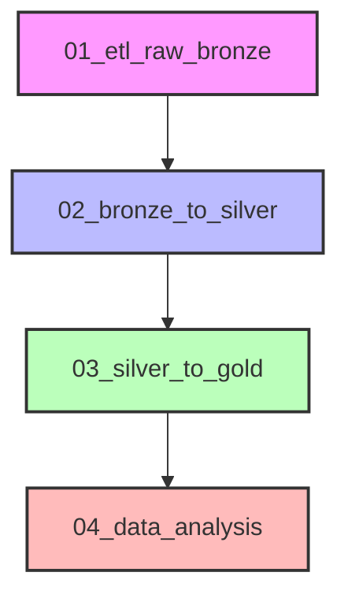
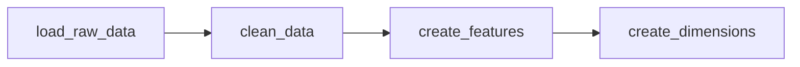
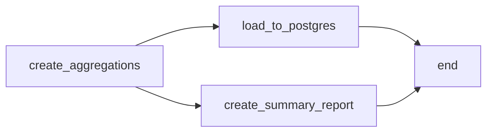
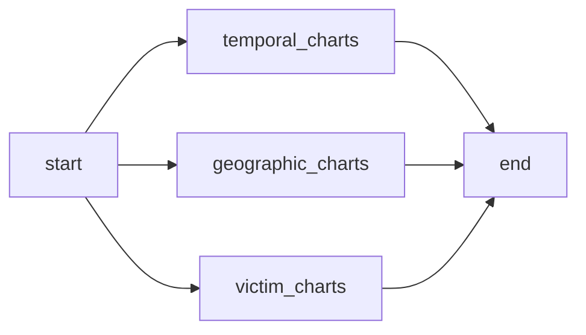

# Pipelines ETL

## 🔄 Visão Geral

O projeto possui notebooks Jupyter para processamento dos dados seguindo a arquitetura Medallion:

## 📋 Descrição dos Notebooks

### 1. 01_etl_raw_bronze.ipynb

**Descrição**: Carrega os dados brutos (CSV) para a camada Bronze.

### 2. 02_bronze_to_silver.ipynb

**Descrição**: Transforma dados brutos para a camada Silver.

#### Etapas:

| Etapa | Descrição |
|------|-----------|
| `load_raw_data` | Carrega CSV bruto |
| `clean_data` | Limpa valores nulos e inválidos |
| `create_features` | Cria features derivadas |
| `create_dimensions` | Gera tabelas de dimensão |

### 3. 03_silver_to_gold.ipynb

**Descrição**: Transforma dados Silver para Data Mart (Gold).

#### Etapas:

| Etapa | Descrição |
|------|-----------|
| `create_aggregations` | Cria tabelas agregadas |
| `load_to_postgres` | Carrega dimensões no PostgreSQL |
| `create_summary_report` | Gera relatório JSON |

### 4. 04_data_analysis.ipynb

**Descrição**: Gera visualizações e análises.

#### Análises:

| Análise | Descrição |
|---------|-----------|
| `temporal_charts` | Gráficos temporais |
| `geographic_charts` | Gráficos geográficos |
| `victim_charts` | Gráficos de perfil de vítimas |

## 🚀 Executando os Notebooks

### Via Jupyter Lab

1. Acesse http://localhost:8888
2. Navegue até a pasta `notebooks/`
3. Execute os notebooks na ordem:
   - `01_etl_raw_bronze.ipynb`
   - `02_bronze_to_silver.ipynb`
   - `03_silver_to_gold.ipynb`
   - `04_data_analysis.ipynb`

## 🔧 Configurações

### Variáveis de Ambiente

| Variável | Descrição | Padrão |
|----------|-----------|--------|
| `POSTGRES_HOST` | Host do PostgreSQL | postgres |
| `POSTGRES_PORT` | Porta do PostgreSQL | 5432 |
| `SBD2_POSTGRES_USER` | Usuário do banco | sbd2 |
| `SBD2_POSTGRES_PASSWORD` | Senha do banco | sbd2_password |
| `SBD2_POSTGRES_DB` | Nome do banco | crime_data |

### Caminhos de Dados

| Caminho | Descrição |
|---------|-----------|
| `/home/jovyan/data_layer/raw` | Dados brutos |
| `/home/jovyan/data_layer/silver` | Dados limpos |
| `/home/jovyan/data_layer/gold` | Data Mart |

## 📊 Métricas

Os notebooks geram métricas durante a execução:

- `raw_count`: Total de registros brutos
- `clean_count`: Total após limpeza
- `silver_count`: Total na camada Silver

## 🔍 Monitoramento

### Via Jupyter Lab

1. Acesse http://localhost:8888
2. Navegue até o notebook desejado
3. Execute as células para visualizar o progresso
4. Verifique os outputs para logs e métricas
