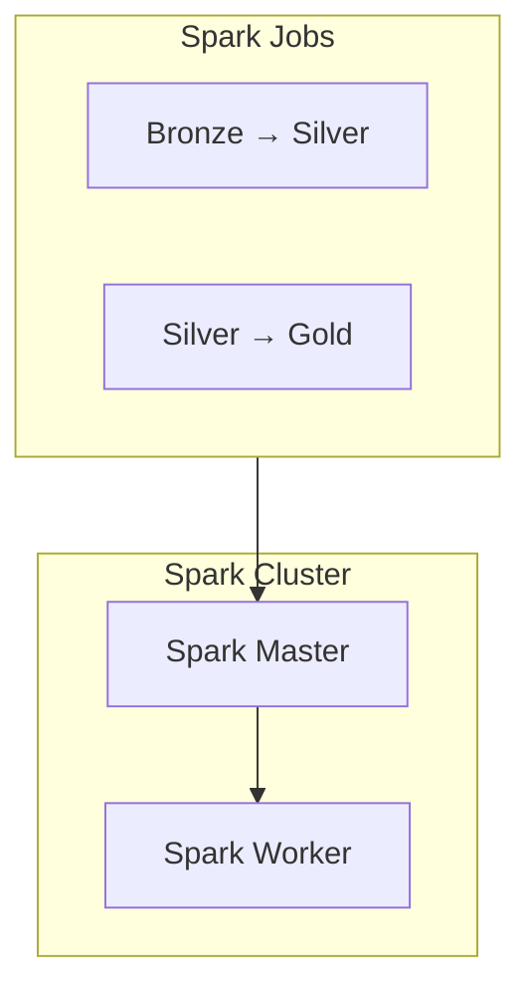

# Apache Spark

## ⚡ Configuração do Spark

O projeto utiliza Apache Spark 3.5 para processamento distribuído de dados.

## 🏗️ Arquitetura Spark



## ⚙️ Configurações

### Arquivo de Configuração

```python
# spark_config/config.py

conf = SparkConf()
conf.setAppName("SBD2 - Crime Data Pipeline")
conf.set("spark.driver.memory", "2g")
conf.set("spark.executor.memory", "2g")
conf.set("spark.executor.cores", "2")
conf.set("spark.sql.shuffle.partitions", "200")
conf.set("spark.sql.adaptive.enabled", "true")
```

### Variáveis de Ambiente

| Variável | Descrição | Padrão |
|----------|-----------|--------|
| `SPARK_MASTER_URL` | URL do Spark Master | spark://spark-master:7077 |
| `SPARK_DRIVER_MEMORY` | Memória do driver | 2g |
| `SPARK_EXECUTOR_MEMORY` | Memória do executor | 2g |

## 📓 Jobs ETL

### Bronze → Silver

```python
# Exemplo de transformação
df_clean = df_raw \
    .filter(F.col("crime_id").isNotNull()) \
    .filter(F.col("date_occurred").isNotNull()) \
    .withColumn("year", F.year("date_occurred")) \
    .withColumn("is_violent", F.when(
        F.col("crime_code").isin(violent_codes), 1
    ).otherwise(0))
```

### Silver → Gold

```python
# Exemplo de agregação
agg_area_year = df_silver \
    .groupBy("area_code", "area_name", "year") \
    .agg(
        F.count("*").alias("total_crimes"),
        F.sum("is_violent").alias("violent_crimes"),
        F.avg("victim_age").alias("avg_victim_age")
    )
```

## 🔌 Integração com PostgreSQL

```python
# Configuração JDBC
jdbc_url = "jdbc:postgresql://postgres:5432/crime_data"
properties = {
    "user": "sbd2",
    "password": "sbd2_password",
    "driver": "org.postgresql.Driver"
}

# Escrita no PostgreSQL
df.write \
    .jdbc(jdbc_url, "gold.dim_area", mode="overwrite", properties=properties)
```

## 📊 Formatos de Dados

### Parquet (Recomendado)

```python
# Leitura
df = spark.read.parquet("/data/silver/crimes")

# Escrita com particionamento
df.write \
    .mode("overwrite") \
    .partitionBy("year") \
    .parquet("/data/gold/crimes")
```

### CSV

```python
# Leitura
df = spark.read \
    .option("header", "true") \
    .option("inferSchema", "true") \
    .csv("/data/raw/crimes.csv")

# Escrita
df.write \
    .mode("overwrite") \
    .option("header", "true") \
    .csv("/data/export/crimes")
```

## 🔍 Monitoramento

### Spark UI

Acesse http://localhost:8081 para monitorar:

- Jobs em execução
- Stages e tasks
- Uso de memória
- Executores

### Logs

```bash
# Via Docker
docker-compose logs -f spark-master spark-worker

# Via Spark UI
# Applications → Logs
```

## 🚀 Otimizações

### Particionamento

```python
# Reparticionamento para paralelismo
df = df.repartition(100)

# Coalesce para reduzir partições
df = df.coalesce(10)
```

### Caching

```python
# Cache em memória
df.cache()

# Persist com nível de storage
df.persist(StorageLevel.MEMORY_AND_DISK)
```

### Broadcast Join

```python
from pyspark.sql.functions import broadcast

# Para tabelas pequenas (dimensões)
df_fact.join(broadcast(df_dim), "key")
```
